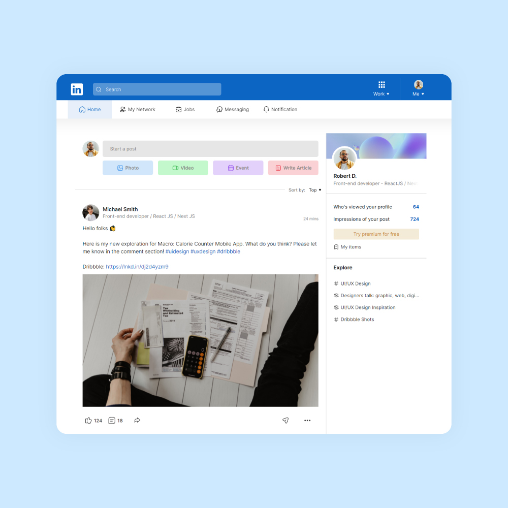

# LinkedIn site redesign and simulation

 

Linkedin site is a unique and excellent site and it is full of comprehensive and useful information and content that I coded an example similar to it as an exercise. Click [here](https://sajjadpaknia.github.io/linkedIn-site-clone/) to see the demo :)

### Technologies

Html - Css - JS

### Contributing
If you are interested, you can make changes on this project and if you have any criticism or suggestion, be sure to let me know. Thanks

### License
[MIT](https://choosealicense.com/licenses/mit/)
